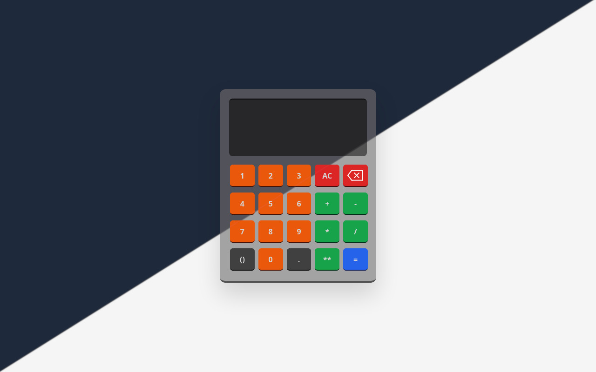
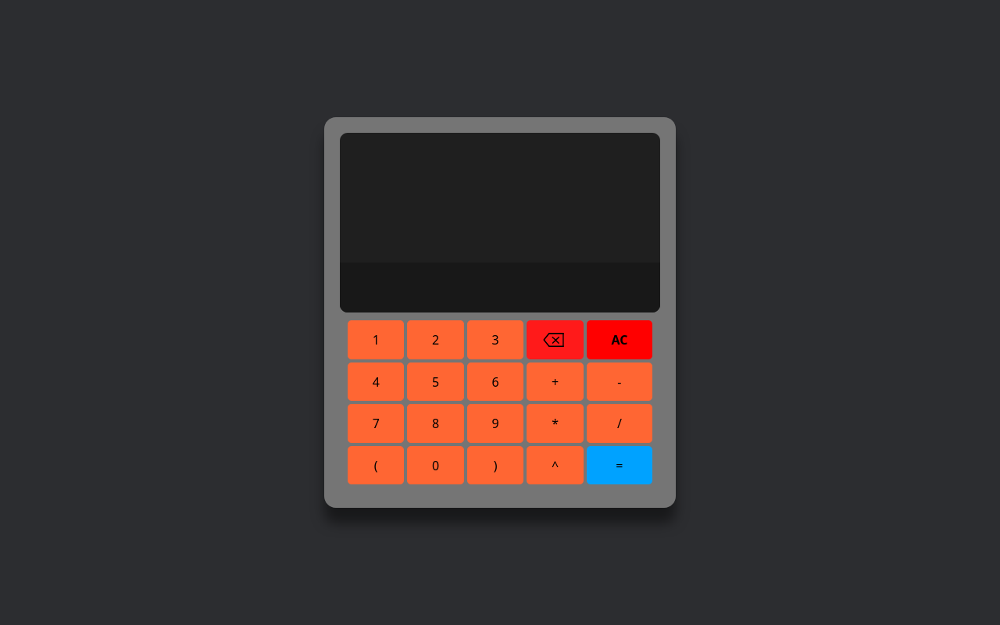

# Calculadora

## Versão 3.0

[Kalkuladora (versão 3.0)](https://corradivm.github.io/kaukuladora/)

### Em progresso...

### Ferramentas utilizadas:

- HTML
- CSS
- JavaScript

## Versão 2.0

[Kalkuladora (versão 2.0)](https://corradivm.github.io/kaukuladora/2.0)

### Melhorias

- Estilo remasterizado
- Tema se adapta automaticamente de acordo com as preferências do usuário (Não funciona em todos os navegadores)
- Código JS otimizado e com sistema de validação bem completo
- Suporte a operações como: `5 + 5(1 + 2)`

### Ferramentas utilizadas:

- HTML
- CSS
- Tailwind CSS
- JavaScript

## Versão 1.0

[Kalkuladora (versão 1.0)](https://corradivm.github.io/kaukuladora/1.0)

### Ferramentas utilizadas:

- HTML
- CSS
- JavaScript
