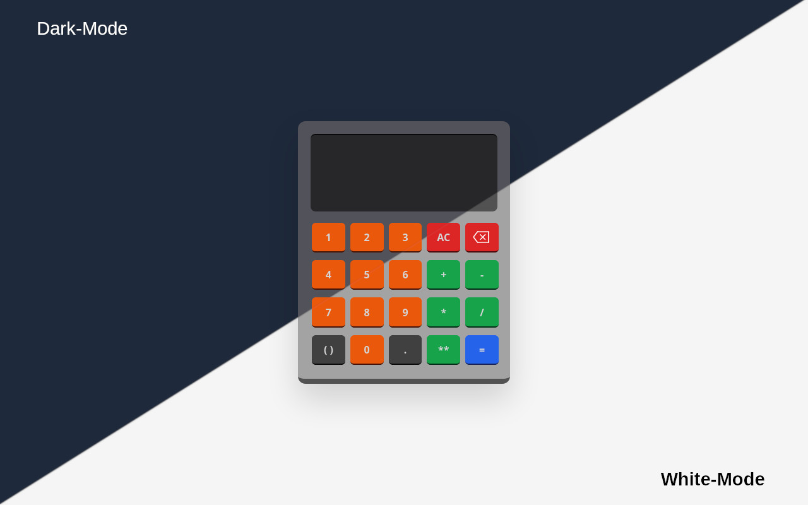

# Calculadora

## Versão 2.0

[Calculadora (versão 2.0)](https://corradivm.github.io/calculadora-simples/)

### Melhorias

- Estilo remasterizado
- Tema se adapta automaticamente de acordo com as preferências do usuário
- Código JS otimizado e com sistema de validação completo

### Ferramentas utilizadas:

- HTML
- CSS
- Tailwind CSS
- JavaScript

## Versão 1.0

[Calculadora (versão 1.0)](https://corradivm.github.io/calculadora-simples/1.0)

### Ferramentas utilizadas:

- HTML
- CSS
- Tailwind CSS
- JavaScript
